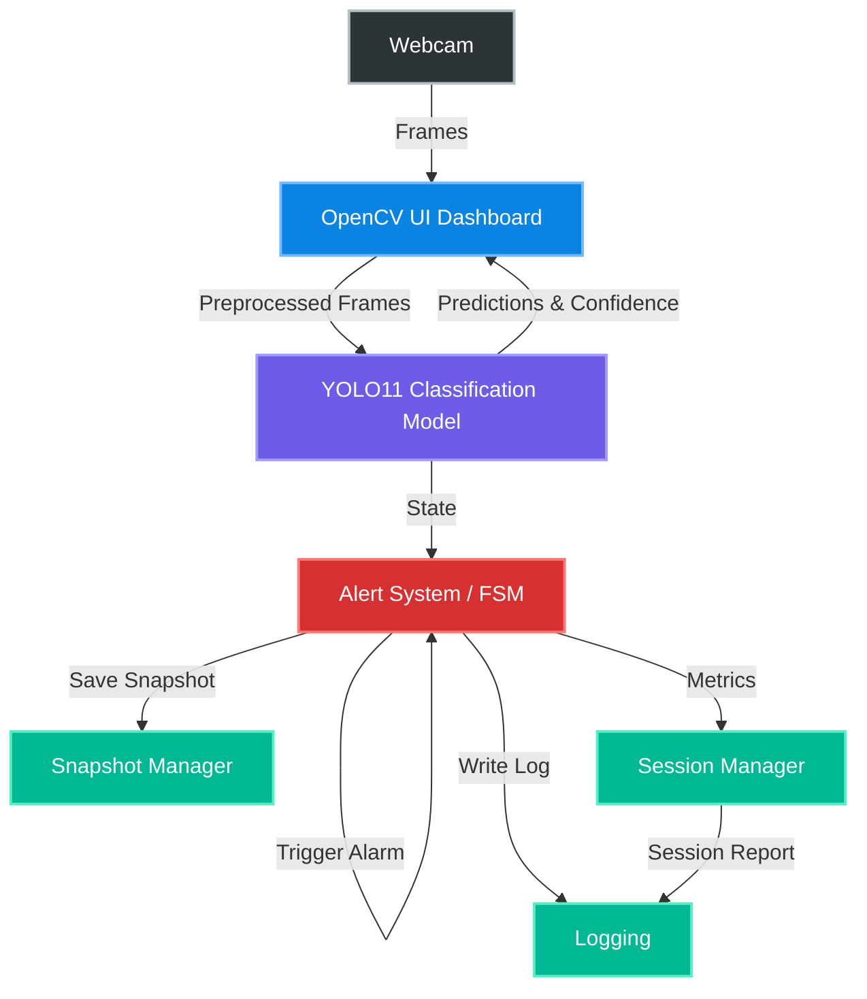

# Drowsiness Detection System using YOLO11 Classification

A real-time, AI-powered driver safety application designed to detect and alert driver drowsiness from a live camera feed. This system integrates a custom-trained YOLO11 Classification model with a Finite State Machine (FSM) to manage alert cycles, audio alarms, automated incident snapshots, and session summaries within a professional heads-up display dashboard.

---

## Project Overview

Drowsy driving is one of the leading causes of fatal traffic accidents worldwide. This project provides a robust, edge-capable solution that processes live webcam streams, classifies the driver's state as either **Drowsy** or **Non_Drowsy**, and runs FSM logic to determine when to trigger alarms. By requiring sustained drowsiness before activating warnings, the system filters out short-term facial movements (such as natural blinking or adjustments), minimizing false positives.

Upon detecting a verified drowsy event, the system:
1. Triggers an audible dual-tone warning alarm.
2. Captures and saves a snapshot of the driver.
3. Logs the event with precise timestamps.
4. Appends statistical details to a runtime session summary that is saved to disk upon exit.

---

## Motivation

Traditional drowsiness detection systems rely heavily on expensive, specialized hardware or complex facial landmark detectors that perform poorly in low-light conditions or under head-rotation angles. By leveraging a state-of-the-art YOLO11 Convolutional Neural Network (CNN) classifier trained on preprocessed, diverse real-world driving datasets, this project provides a hardware-agnostic solution that operates efficiently on consumer-grade webcams and CPUs, making driver safety technology accessible.

---

## Features

- **Real-Time Webcam Inference**: Optimized, multi-threaded frame processing queue featuring a mirrored selfie view.
- **YOLO11 Classification**: Integrates the YOLO11m-cls framework to perform fast, high-accuracy binary classification.
- **Binary State Classification**: Standardized to distinguish between target classes: `Drowsy` and `Non_Drowsy`.
- **Professional OpenCV Dashboard**: Semi-transparent rounded panels presenting system information, live prediction statistics, and confidence meters.
- **Finite State Machine (SAFE ↔ DROWSY)**:
  - **SAFE → DROWSY**: Triggered when the consecutive frame count exceeds the threshold. Plays the alarm, saves exactly one snapshot, and records a warning log.
  - **Stay in DROWSY**: Loops sound playback while suppressing duplicate disk writes or redundant warning logs.
  - **DROWSY → SAFE**: Stops sound instantly, resets counts, and logs driver recovery.
- **Audio Alarm System**: Programmatically synthesizes a high-contrast, dual-tone warning siren WAV file on startup using wave math, resolving cross-platform media dependencies.
- **Incident Snapshot Capture**: Auto-saves JPEGs to the disk upon alarm triggers, with support for manual snapshots via hotkeys.
- **Session Logging**: Detailed, timestamped logs written to disk for every execution.
- **Session Summary**: Compiles session statistics (frames, min/max/average FPS, total drowsiness events, average confidence) into a console report and saves it to a text file on exit.
- **Modular Software Architecture**: Completely separated modules adhering to SOLID design principles.

---

## Project Architecture & Workflow

### Architecture Diagram



### High-Level Workflow

```text
       [ Dataset Preparation ]
                  ↓
       [ Model Training (YOLO11) ]
                  ↓
         [ YOLO11m-cls Model ]
                  ↓
          [ Webcam Capture ]
                  ↓
       [ Frame Classification ]
                  ↓
      [ Finite State Machine (FSM) ]
                  ↓
   ┌──────────────┴──────────────┐
   ▼                             ▼
[ SAFE State ]            [ DROWSY State ]
                                 │
                                 ├──► [ Play Alarm Sound ]
                                 ├──► [ Save Frame Snapshot ]
                                 ├──► [ Write Session Log ]
                                 └──► [ Update Session Summary ]
```

---

## Dataset Preparation

The model was **not** trained using a single, uniform dataset. Driving environments vary significantly in lighting, camera angles, and driver ethnicities. To build a robust model, the training dataset was created by combining, cleaning, and preprocessing images from four distinct public datasets.

### Dataset Processing Pipeline
1. **Dataset Aggregation**: Combined selected subsets of images from DDD, YawDD, UTA-RLDD, and MRL Eye datasets.
2. **Data Cleaning**: Removed corrupted, out-of-focus, or highly redundant frames.
3. **Standardization of Labels**: Unified disparate labels (such as closed eyes, yawning, nodding, or distracted states) into two distinct binary classes: `Drowsy` and `Non_Drowsy`.
4. **Resizing and Normalization**: Preprocessed all inputs to meet the default target dimensions required for YOLO classification training.

### Source Datasets

| Dataset Name | Primary Purpose | Source | Dataset Link |
| :--- | :--- | :--- | :--- |
| **Driver Drowsiness Dataset (DDD)** | Provides diverse facial positions, head poses, and illumination conditions of active drivers. | Kaggle | [Link](https://www.kaggle.com/datasets/ismailnasri20/driver-drowsiness-dataset-ddd) |
| **YawDD Dataset** | Video frames capturing yawning mouth open/close states under various in-car configurations. | Kaggle | [Link](https://www.kaggle.com/datasets/enider/yawdd-dataset) |
| **UTA-RLDD Dataset** | Video sequences of sleepy and alert subjects, capturing realistic micro-sleep behaviors. | Kaggle | [Link](https://www.kaggle.com/datasets/minhngt02/uta-rldd) |
| **MRL Eye Dataset** | Large-scale database of eye images focusing on iris occlusion and open/closed eyelid variations. | Kaggle | [Link](https://www.kaggle.com/datasets/akashshingha850/mrl-eye-dataset) |

---

## Model Information

- **Architecture**: YOLO11 Classification (YOLO11m-cls)
- **Base Framework**: Ultralytics YOLOv11
- **Optimization Backends**: PyTorch (`.pt` weights) and ONNX (`.onnx` weights) formats
- **Target Classes**:
  1. `Drowsy` (Class index 0)
  2. `Non_Drowsy` (Class index 1)
- **Input Dimensions**: 224x224 pixels

---

## Project Structure

```
Drowsiness_Detection_System/
├── Model/
│   ├── best.pt                  # PyTorch model weights
│   └── best.onnx                # Exported ONNX model weights
├── outputs/                     # Auto-saved incident snapshots (git-ignored)
├── logs/                        # Session logs and reports (git-ignored)
├── sounds/
│   └── alarm.wav                # Siren audio file (auto-generated if missing)
├── app.py                       # Main application runner and orchestration
├── camera.py                    # Webcam capture and filesystem snapshot saving
├── classifier.py                # Inference pipeline wrapper for YOLO11
├── alert.py                     # FSM logic, states, and AlarmPlayer thread loop
├── ui.py                        # Professional OpenCV HUD rendering functions
├── session.py                   # Metric tracking, console summaries, and file reports
├── config.py                    # Constants, threshold limits, colors, and directory paths
├── utils.py                     # Setup functions, timestamps, and FPS counter
├── requirements.txt             # Required Python dependencies
├── .gitignore                   # Workspace git configuration
└── README.md                    # Project documentation
```

---

## Installation

### 1. Clone the Repository
```bash
git clone https://github.com/meswaramuthu/Drowsiness_Detection_System.git
cd Drowsiness_Detection_System
```

### 2. Install Required Packages
Install the required packages using pip:
```bash
pip install -r requirements.txt
```

---

## Requirements

The project dependencies are managed inside `requirements.txt`:
*   `ultralytics>=8.0.0` (YOLO inference and model API)
*   `opencv-python>=4.8.0` (Image operations and HUD display)
*   `numpy>=1.24.0` (Matrix operations)
*   `Pillow>=10.0.0` (Helper image format conversions)

> [!NOTE]
> The sound player in `alert.py` uses the built-in Windows module `winsound`. If you are running the project on macOS or Linux, the code automatically falls back to `playsound` or system command players (`afplay`/`aplay`).

---

## How to Run

### Run the Real-Time System
To launch the real-time driver monitoring dashboard with camera feedback:
```bash
python app.py
```

### Hotkeys and Controls
While the camera dashboard window is active:
*   `Q` or `ESC`: Quit the application cleanly. This ends the session, stops background audio, outputs the session report, and saves it to a file.
*   `S`: Capture a manual snapshot of the current frame to the `outputs/` directory.
*   `R`: Manually reset the alert state to `SAFE`.

### Run Standalone Model Analyzer
To inspect your trained classification weights and view inference results on a synthetic test face:
```bash
python analyze_model.py --synthetic
```

---

## Dashboard Preview

| Screenshot Panel | Description | Placeholder |
| :--- | :--- | :--- |
| **Home Screen** | Visual dashboard overview after camera warmup. | *[Insert home_screen.jpg]* |
| **SAFE State** | Driver awake with green indicator LED and high confidence. | *[Insert safe_state.jpg]* |
| **DROWSY State** | Driver asleep with red indicator LED and flashing warning frame border. | *[Insert drowsy_state.jpg]* |
| **Session Summary** | Formatted report written to log file upon termination. | *[Insert session_summary.jpg]* |

---

## Technologies Used

*   **Python**: Core programming language.
*   **OpenCV**: Image stream acquisition, transformations, and HUD rendering.
*   **Ultralytics YOLO11**: Machine learning backend API.
*   **NumPy**: Fast array calculations.
*   **Pillow**: Image data handling.
*   **Winsound / Pygame**: Cross-platform audio playback support.
*   **Git & GitHub**: Version control and hosting.

---

## Future Improvements

These enhancements are planned for future releases to make the system more robust for commercial use:

- **Secondary Face Detection**: Implement a lightweight face detector (e.g., MediaPipe Face Mesh) to verify a face is present in the frame before running classification.
- **Eye Aspect Ratio (EAR) Verification**: Combine YOLO classification with EAR calculations to measure blink duration and blink frequency.
- **Head Pose Estimation**: Trace pitch, yaw, and roll angles to detect when the driver's head tilts downward or turns away from the road.
- **ONNX Runtime Optimization**: Load the model directly using `onnxruntime` to run inference on edge devices without PyTorch dependencies.
- **Mobile Deployment**: Convert weights to TensorFlow Lite (TFLite) or CoreML formats for iOS and Android deployment.

---

## License

This project is licensed under the MIT License. See the [LICENSE](LICENSE) file for details.

---

## Author

*   **meswaramuthu** - [GitHub Profile](https://github.com/meswaramuthu)
